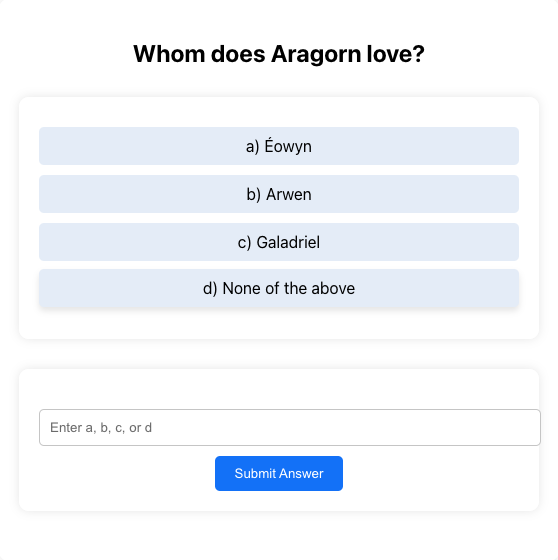
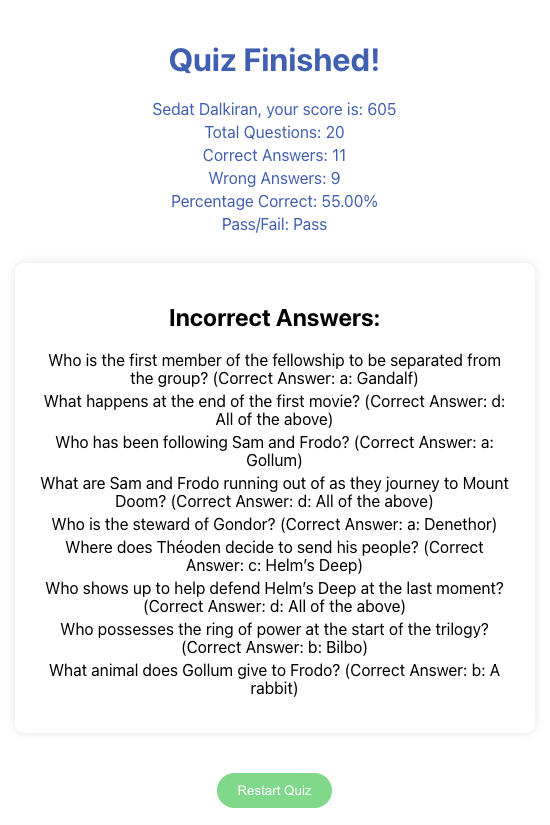

# Multiple Choice Quiz App

## Getting Started
These instructions will get you a copy of the project up and running on your local machine for development and testing purposes.

### Prerequisites
What things you need to install the software and how to install them:
- Python 3
- pip
- virtualenv
- npm

### Installing and Running the Backend
A step-by-step series of examples that tell you how to get a development environment running:

#### Navigate to the backend directory:
```bash
cd path/to/backend
```

#### Activate the virtual environment:
```bash
source venv/bin/activate  # On Windows use `venv\Scripts\activate`
```

#### Install the required packages:
```bash
pip install -r requirements.txt
```

#### Set the Flask application environment variable:
```bash
export FLASK_APP=run.py  # On Windows use `set FLASK_APP=run.py`
```

#### Run the Flask application:
```bash
flask run
```

#### (Optional) Run tests:
```bash
pytest
```

### Installing and Running the Frontend
Navigate to the frontend directory:
```bash
cd path/to/frontend
```

Install the required packages:
```bash
npm install
```

Start the React application:
```bash
npm start
```
The React application will launch in your default web browser.


## Built With
- Flask - The web framework used for the backend.
- React - The web library used for the frontend.
- SQLite - The database used.
- Alembic - Database migrations.


## Screenshots
Here are some screenshots from the application:




